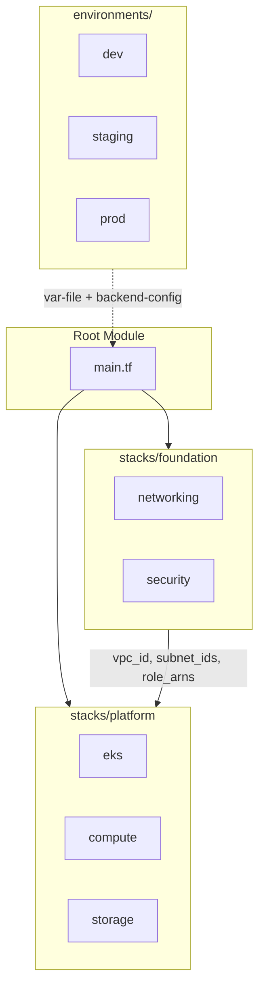
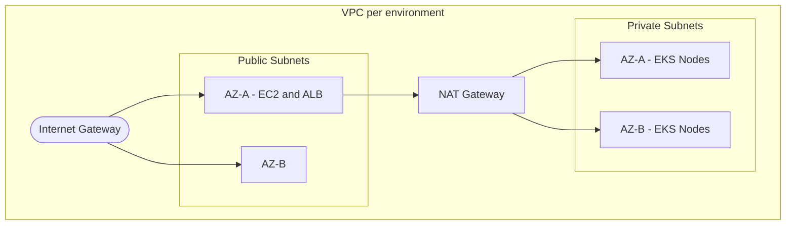

# terraform-aws-eks

[](https://github.com/thisisgaganbirru/terraform-aws-eks/actions/workflows/terraform.yml)
[](https://www.terraform.io)
[](https://aws.amazon.com)
[](LICENSE)

Production-grade AWS infrastructure built with Terraform — a layered stack architecture that provisions and manages a full EKS platform across isolated dev, staging, and prod environments. Each environment gets its own VPC, EKS cluster, and S3 state file. IAM follows IRSA least-privilege throughout.

## Table of Contents

- [Architecture](#architecture)
- [What's Provisioned](#whats-provisioned)
- [Project Structure](#project-structure)
- [Prerequisites](#prerequisites)
- [Usage](#usage)
- [Environments](#environments)
- [Security Design](#security-design)
- [EKS Node Groups](#eks-node-groups)
- [IRSA — IAM Roles for Service Accounts](#irsa--iam-roles-for-service-accounts)
- [Tagging Strategy](#tagging-strategy)
- [CI/CD](#cicd)

## Architecture





## What's Provisioned

| Component          | Details                                                                                                             |
| ------------------ | ------------------------------------------------------------------------------------------------------------------- |
| **VPC**            | Custom VPC per environment, public + private subnets across 2 AZs, NAT Gateway, route tables                        |
| **EKS Cluster**    | Kubernetes v1.30, private node networking, full control plane logging to CloudWatch                                 |
| **Node Groups**    | 3 groups: `main` (on-demand), `system` (on-demand, CriticalAddonsOnly taint), `spot` (cost-optimized)               |
| **Managed Addons** | CoreDNS, kube-proxy, VPC CNI, EBS CSI Driver — all pinned versions                                                  |
| **OIDC / IRSA**    | OIDC provider; Cluster Autoscaler, EBS CSI, ALB Controller each have scoped IAM roles with `sub` + `aud` conditions |
| **EC2**            | Bastion/web instance, configurable SSH CIDR, IAM instance profile, separate EBS data volume                         |
| **RDS MySQL**      | v8.0, private subnet only, encrypted at rest, 7-day backups, deletion protection enabled                            |
| **S3**             | Versioned, AES256 encrypted, public access fully blocked                                                            |
| **Remote State**   | Per-environment S3 state files, isolated by key prefix — dev/staging/prod never share state                         |

## Project Structure

```text
terraform-aws-eks/
├── main.tf                        # root — calls foundation then platform stacks
├── variables.tf                   # all input variables with validation
├── outputs.tf                     # cluster endpoint, vpc id, rds endpoint
├── locals.tf                      # common_tags derived from var.environment
├── backend.tf                     # partial S3 backend — key injected at init time
├── versions.tf                    # required_version + required_providers
├── stacks/
│   ├── foundation/                # networking + security
│   └── platform/                  # eks + compute + storage
├── modules/
│   ├── networking/                # VPC, subnets, IGW, NAT, route tables
│   ├── security/                  # IAM roles for EC2, EKS cluster, EKS nodes
│   ├── compute/                   # EC2 instance, security group, EBS volume
│   ├── storage/                   # RDS MySQL + S3 bucket (merged)
│   └── eks/                       # EKS cluster, node groups, OIDC, IRSA, addons
├── environments/
│   ├── dev/
│   │   ├── terraform.tfvars       # dev input values
│   │   └── backend.tfvars         # dev S3 state key + DynamoDB table
│   ├── staging/
│   │   ├── terraform.tfvars
│   │   └── backend.tfvars
│   └── prod/
│       ├── terraform.tfvars
│       └── backend.tfvars
└── .github/workflows/
    ├── terraform.yml              # CI: fmt, validate, plan, tfsec
    └── terraform-apply.yml        # CD: apply with manual approval gate
```

## Prerequisites

- Terraform ≥ 1.9
- AWS CLI configured with credentials (`aws configure`)
- An existing EC2 key pair in the target region
- An S3 bucket and DynamoDB table for remote state (must exist before `terraform init`)

> [!IMPORTANT]
> `db_password` has no default value and no fallback. It must be passed via `TF_VAR_db_password` environment variable or GitHub Secrets. Never set it in a `.tfvars` file.

## Usage

### 1. Clone the repo

```bash
git clone https://github.com/thisisgaganbirru/terraform-aws-eks.git
cd terraform-aws-eks
```

### 2. Initialise with environment backend

```bash
# dev
terraform init -backend-config="environments/dev/backend.tfvars"

# staging
terraform init -reconfigure -backend-config="environments/staging/backend.tfvars"

# prod
terraform init -reconfigure -backend-config="environments/prod/backend.tfvars"
```

### 3. Plan and apply

```bash
# dev
export TF_VAR_db_password="your-password"
terraform plan  -var-file="environments/dev/terraform.tfvars"
terraform apply -var-file="environments/dev/terraform.tfvars"

# prod
terraform plan  -var-file="environments/prod/terraform.tfvars"
terraform apply -var-file="environments/prod/terraform.tfvars"
```

### 4. Connect kubectl

```bash
aws eks update-kubeconfig --region us-east-1 --name eks-dev
kubectl get nodes
```

### Destroy

```bash
terraform destroy -var-file="environments/dev/terraform.tfvars"
```

> [!CAUTION]
> RDS, S3, and the EKS cluster have `prevent_destroy = true`. Remove the lifecycle block before running destroy on production resources — this is intentional, not a bug.

## Environments

Each environment has its own VPC CIDR range and isolated S3 state key — no shared state between envs.

| Environment | VPC CIDR    | EKS Cluster | On-demand Nodes | Spot Nodes | Public Endpoint |
| ----------- | ----------- | ----------- | --------------- | ---------- | --------------- |
| dev         | 10.0.0.0/16 | eks-dev     | 1 (max 2)       | 0–2        | ✅              |
| staging     | 10.1.0.0/16 | eks-staging | 2 (max 4)       | 0–4        | ✅              |
| prod        | 10.2.0.0/16 | eks-prod    | 3 (max 6)       | 0–6        | ❌              |

## Security Design

- **No hardcoded secrets** — `db_password` has no default; supplied via `TF_VAR_db_password` or GitHub Secrets only
- **IRSA scoped trust** — each IRSA role locked to a specific `namespace:serviceaccount` via OIDC `StringEquals` on both `:sub` and `:aud`
- **Node SG locked down** — nodes accept only port 443 and 1025–65535 from the control plane; no direct internet ingress
- **RDS isolated** — MySQL access restricted to the web tier security group only; no public endpoint
- **S3 hardened** — `aws_s3_bucket_public_access_block` blocks all public ACLs and policies
- **Deletion protection** — `prevent_destroy` lifecycle on RDS, S3 bucket, and EKS cluster
- **State isolation** — each environment writes to its own S3 key; a dev apply cannot touch prod state

## EKS Node Groups

| Node Group | Capacity  | Instance Types                        | Use Case                                                       |
| ---------- | --------- | ------------------------------------- | -------------------------------------------------------------- |
| `main`     | ON_DEMAND | `t3.medium`                           | General application workloads                                  |
| `system`   | ON_DEMAND | `t3.medium`                           | kube-system only — taint: `CriticalAddonsOnly=true:NoSchedule` |
| `spot`     | SPOT      | `t3.medium`, `t3.large`, `t3a.medium` | Cost-optimised batch and stateless workloads                   |

Spot nodes are tagged for Cluster Autoscaler discovery:

```text
k8s.io/cluster-autoscaler/<cluster-name> = owned
k8s.io/cluster-autoscaler/enabled        = true
```

## IRSA — IAM Roles for Service Accounts

All IRSA roles are defined inside `modules/eks` alongside the OIDC provider that backs them.

| Role               | Namespace     | Service Account                | Permissions           |
| ------------------ | ------------- | ------------------------------ | --------------------- |
| Cluster Autoscaler | `kube-system` | `cluster-autoscaler`           | ASG describe/scale    |
| EBS CSI Driver     | `kube-system` | `ebs-csi-controller-sa`        | EC2 volume management |
| ALB Controller     | `kube-system` | `aws-load-balancer-controller` | ELB management        |

Each role uses `StringEquals` conditions on both `:sub` (service account) and `:aud` (audience) — preventing token reuse and cross-account escalation.

## Tagging Strategy

Every resource receives tags via `merge(var.tags, { Name = "..." })`. Tags are resolved in `locals.tf` from `var.environment`:

| Tag                | Value                                                          |
| ------------------ | -------------------------------------------------------------- |
| `Project`          | `terraform-aws-eks`                                            |
| `Repository`       | `thisisgaganbirru/terraform-aws-eks`                           |
| `ManagedBy`        | `terraform`                                                    |
| `Environment`      | `dev` / `staging` / `prod`                                     |
| `Owner`            | `platform-team`                                                |
| `CostCenter`       | `engineering-dev` / `engineering-staging` / `engineering-prod` |
| `TerraformVersion` | `1.9`                                                          |
| `EKSVersion`       | `1.30`                                                         |

Enables AWS Cost Explorer filtering by environment and cost center without any manual tagging.

## CI/CD

### Terraform CI (`terraform.yml`)

Triggered on every push and pull request to `main`:

| Step          | Tool                   | Purpose                                       |
| ------------- | ---------------------- | --------------------------------------------- |
| Format check  | `terraform fmt -check` | Enforces consistent HCL formatting            |
| Validate      | `terraform validate`   | Checks syntax and module references           |
| Plan          | `terraform plan`       | Previews changes against dev environment      |
| Security scan | `tfsec`                | Flags misconfigurations and policy violations |

### Terraform Apply (`terraform-apply.yml`)

Triggered on merge to `main`:

- Requires manual approval via GitHub Environments (`production`)
- Runs `terraform apply -auto-approve` against prod after approval
- AWS credentials injected via GitHub Secrets — never stored in code

### Required GitHub Secrets

| Secret                  | Description              |
| ----------------------- | ------------------------ |
| `AWS_ACCESS_KEY_ID`     | AWS access key for CI/CD |
| `AWS_SECRET_ACCESS_KEY` | AWS secret key for CI/CD |
| `DB_PASSWORD`           | RDS master password      |
